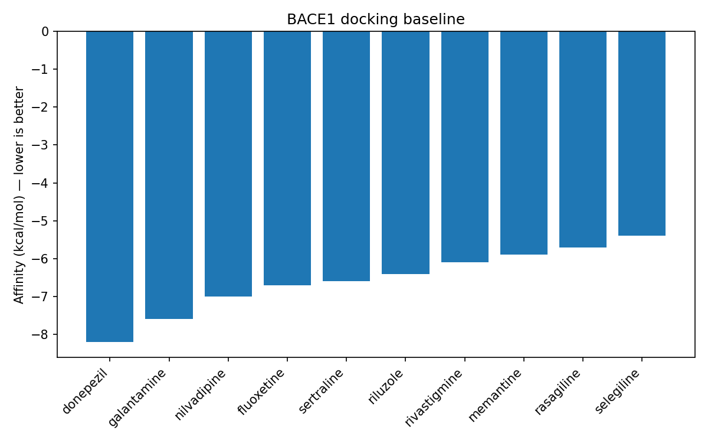

# Docking Baseline (BACE1, 4DVF)

- Grid center: [3.061, -0.128, 17.532]

- Candidates docked: 10

## Top 5 by composite score

| ligand      |   affinity_kcal_mol | BBB_pass   |   composite_score |
|:------------|--------------------:|:-----------|------------------:|
| donepezil   |                -8.2 | True       |          2.24703  |
| galantamine |                -7.6 | True       |          1.51641  |
| nilvadipine |                -7   | True       |          0.785789 |
| fluoxetine  |                -6.7 | True       |          0.420478 |
| sertraline  |                -6.6 | True       |          0.298708 |

